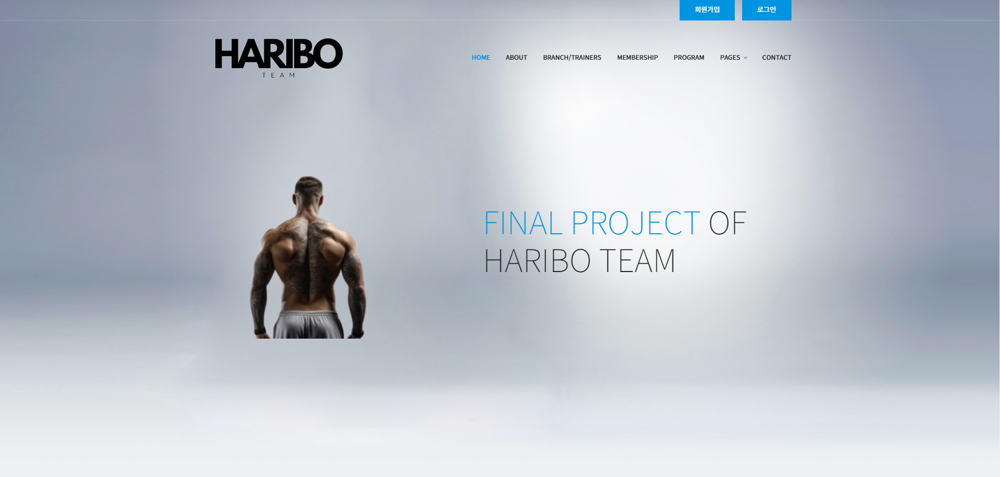
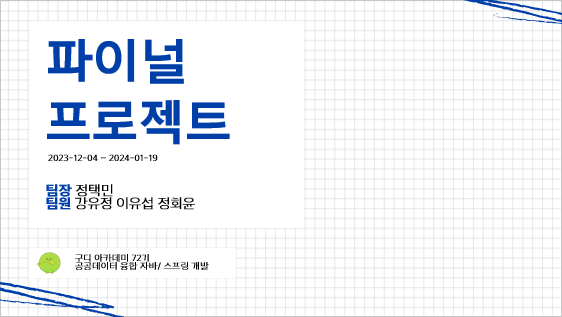
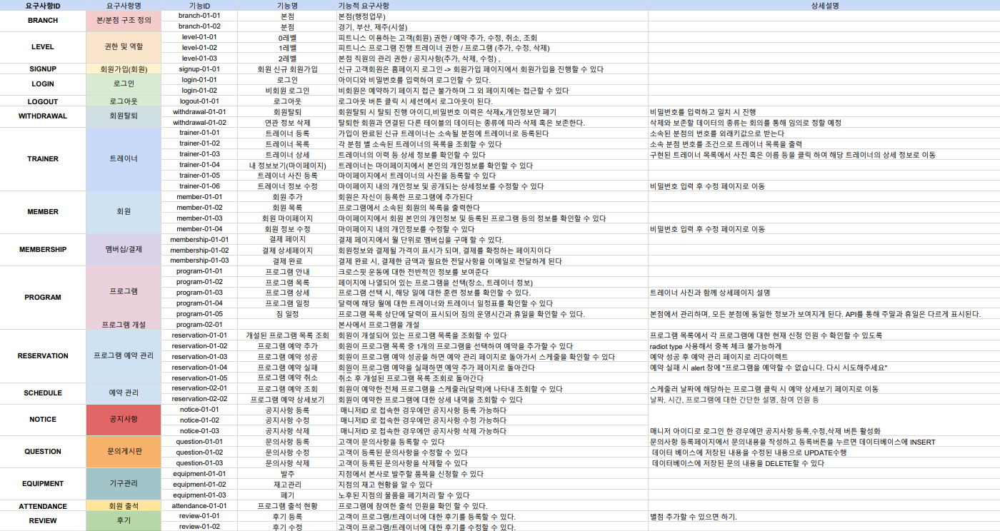
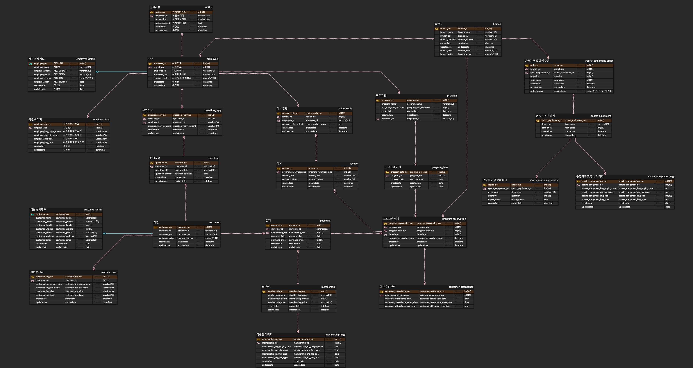
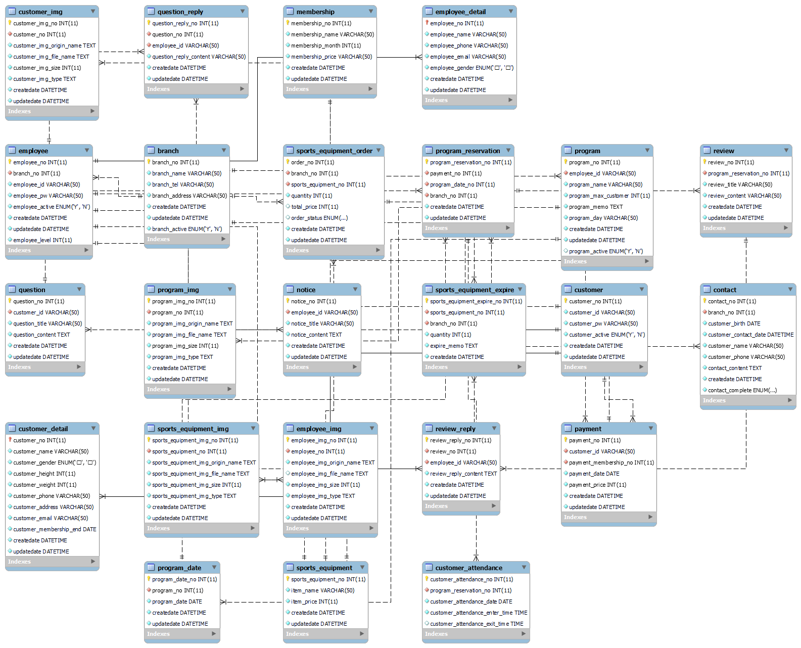
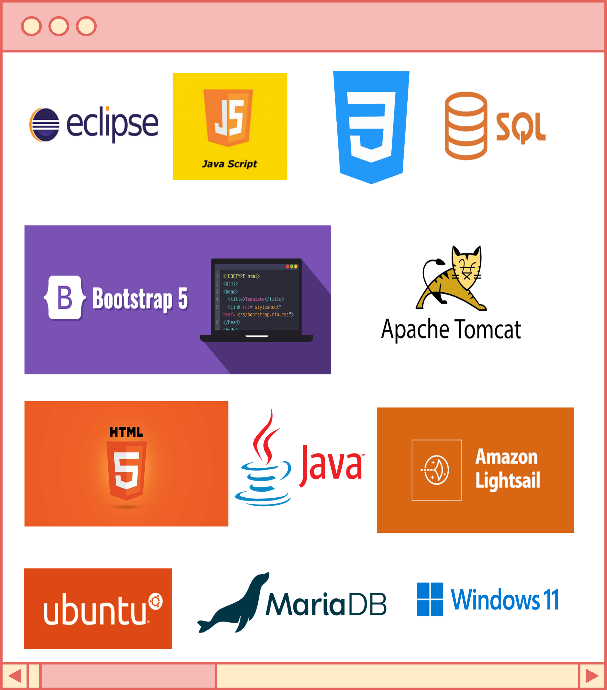

# 🧸하리보 홈페이지 메인 화면🧸

[](http://43.202.97.125/haribo/home)   
_이미지를 클릭하면 하리보 홈페이지로 이동합니다._

# 🧑🏻‍💻하리보팀 파이널 프로젝트🧑🏻‍💻
> * 참여자 : 정택민, 강유정, 이유섭, 정회윤   
> * 프로젝트 기간 : 2023/12/04 ~ 2024/01/19
   
# 📑프로젝트의 목표📑
> * **MVC 모델 방식으로 홈페이지 구현하기**
> * 팀원들과의 협업 & 소통
> * 깃허브 사용 익숙해지기
> * 부트스트랩 템플릿 적용하여 지점/고객 관리 프로그램 구현하기 

# ⌨️프로젝트 개발 내용🖱️
> * 부트스트랩 템플릿을 적용하여 요구사항정의서에 작성한 기능들 구현하기
> * MVC 방식을 사용하여 지점/고객 관리 프로그램 구현
> * 고객/ 사원 접근 가능한 부분 나누어서 개발
> * 매니저 관리 페이지 따로 생성해 필요 기능들 활성화

# 📝파이널 프로젝트 PPT
[](https://drive.google.com/file/d/1iDxK6rmUoNXXrg9TBseERYTLpUcjLAlu/view?usp=sharing)   
_이미지를 클릭하면 PPT 문서로 이동합니다._

# 🔗요구사항 정의서

[](https://drive.google.com/file/d/1eyw7G-9bwDMQsVLG5sTV53ZFLz4uG2Og/view?usp=sharing)
_구글 스프레드 시트로 팀원들과 함께 작성한 요구사항 정의서 입니다._  
_이미지를 클릭하면 요구사항 정의서 문서로 이동합니다._

# 📂ERD 다이어그램
> ### ERD Cloud 다이어그램
[](https://www.erdcloud.com/d/e8Exd7Bkeo7t2YP9W)
_이미지를 클릭하면 ERD Cloud로 이동합니다._
> ### Workbench 다이어그램


# ⚙️담당 파트⚙️
> ### 정택민
> * 회원이 이용하는 홈페이지 구현

> ### 강유정
> * 사원이 이용하는 홈페이지 구현

> ### 정회윤
> * 회원이 이용하는 홈페이지 구현

> ### 이유섭
> * 사원이 이용하는 홈페이지 구현

# 🖥️개발환경🖥️

>    

> **OS**   
> ```WINDOWS11```    
> **Language**   
> ```SQL``` ```Java```   
> **Tool**   
> ```Spring Tools Suite 4```     
> **Skills**   
> ```Java``` ```HTML5``` ```JQuery``` ```BootStrap5``` ```CSS``` ```JSTL``` ```JavaScript```  
> **Database**   
> ```MariaDB``` ```HeidiSQL```   
> **Server**   
> ```Apache Tomcat10```   
